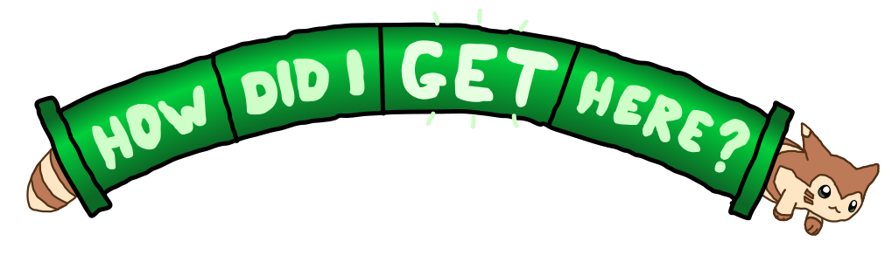

<a href='https://how-did-i-get-here.net/'>

<strong>Visit how-did-i-get-here.net &raquo;</strong>

</a>

---

A tool/website/article about how routing on the Internet works.

On load, it runs a traceroute to your public IP, loading ASN and PeeringDB information, and live HTTP streams the results. Then, 500 lines of if statements render a generative article describing the path of network provenance your traceroute covered. Finally, I include a bonus article about how the traceroute program works and what BGP is.

The traceroute and all lookups are powered by a custom traceroute library and agent I wrote from scratch in Rust, called [ktr](https://github.com/kognise/ktr/). It's designed to be very fault-tolerant and highly concurrent, allowing it to make sense in the context of a website like this!

I tried to use Bun for this, but Node HTTP socket support wasn't comprehensive enough, so I ported it back to plain old Node with TypeScript. This always seems to happen. I am still using Bun as a package manager, though, thus the bun.lockb! I chose to do a hybrid approach (read: I developed this willy-nilly) wherein the complex, reliable code is all TypeScript, but the entrypoint is actually a JavaScript file that can do wibbly wobbly object manipulation with no trouble!

My approach to HTTP streaming is sorta cheating. It sends the first half of a page rendered with EJS (before a comment used to split it). Then, it streams another EJS fragment over and over again, separated by a style tag that hides the previous fragment with CSS. When the traceroute is finished streaming, it renders and sends the rest of the file. This lets me stream a whole UI segment without JavaScript *or* much complexity :)

I don't have much else to put in this README, but you should [check out the actual website](https://how-did-i-get-here.net/) because it's much cooler than reading about it!